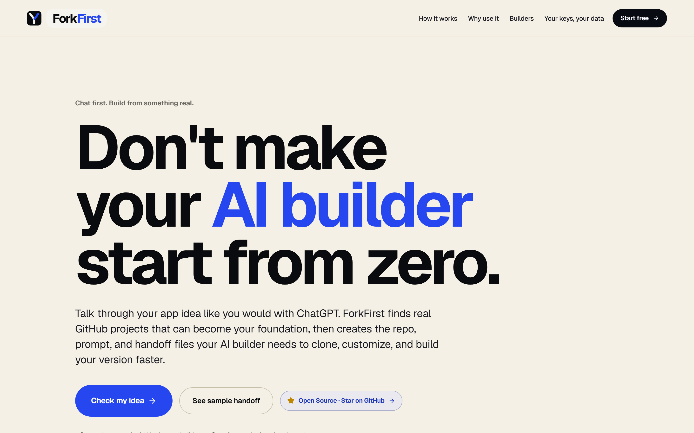
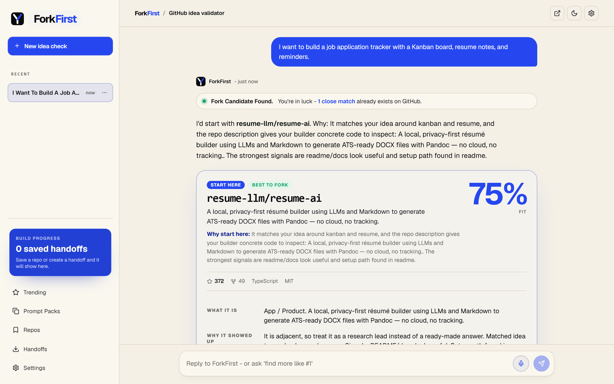
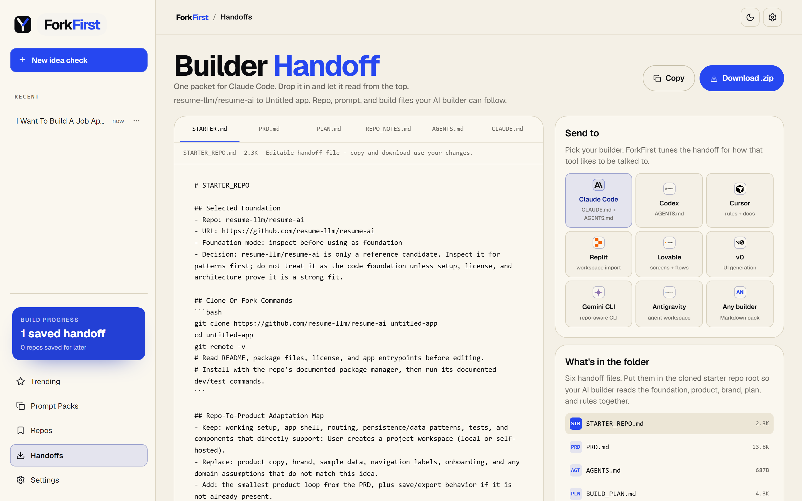

# ForkFirst

[](https://forkfirst.dev)
[](./LICENSE)
[](https://nextjs.org/)
[](#security-model)

ForkFirst helps you find a working open-source foundation for your app idea, then turn it into a clean handoff for Cursor, Claude Code, Codex, Replit, v0, and other AI builders.

A free open-source tool for repo-first idea research and AI-builder handoffs.

> Start with a working foundation. Build your own product faster.

[Try the hosted demo](https://forkfirst.dev) - [Read the security model](./SECURITY.md) - [View sample handoffs](#public-sample-handoffs)

## What it does

Talk through your app idea like you would with ChatGPT. ForkFirst searches GitHub for real projects that may already include useful pieces like auth, dashboards, CRUD, payments, admin panels, layouts, or workflows. Then it helps you decide what to keep, replace, ignore, or inspect before your AI builder starts coding.

ForkFirst is not about cloning apps. It is about finding a better starting point, rebranding, redesigning, refocusing, and building your own product with real code as context.

## 60-second flow

1. Describe the product you want to build.
2. ForkFirst searches public GitHub repos most people would not know to search for.
3. It ranks the strongest foundations, references, and caution signals.
4. You pick a repo or ask follow-up questions.
5. ForkFirst generates a Builder Handoff.
6. Give the repo, prompt, and files to Claude Code, Codex, Cursor, Replit, Lovable, v0, Gemini CLI, Antigravity, or another AI builder.

## Screenshots

| Start with an idea | Compare working foundations | Export the builder handoff |
|---|---|---|
|  |  |  |

## Public sample handoffs

These are example output packets checked against live GitHub Search API results on 2026-05-17. Re-run your own search before building from any repo.

- [Job application tracker](./public/sample-handoffs/job-application-tracker.md)
- [Local-first journal](./public/sample-handoffs/local-first-journal.md)
- [AI agent dashboard](./public/sample-handoffs/ai-agent-dashboard.md)
- [Full handoff with license + attribution sections (illustrative)](./public/sample-handoffs/full-handoff-with-license-attribution.md) — shows the per-license literacy block, Foundation Spec, and "How To Use This Foundation Respectfully" checklist that ship in every handoff.

## Use cases

- You have an app idea and do not know what already exists.
- You want your AI builder to start from a repo instead of a blank page.
- You want to compare starter repos before asking Cursor, Claude Code, Codex, or Replit to build.
- You found a repo and want a plain-English read on whether it is a foundation, reference, or caution.
- You want a Markdown handoff your AI builder can follow.

## Features

- Chat-first GitHub search and ranking.
- Builder Handoff exports for Claude Code, Codex, Cursor, Replit, Lovable, v0, Gemini CLI, Antigravity, and generic Markdown.
- `STARTER_REPO.md`, `PRD.md`, `BUILD_PLAN.md`, `REPO_STARTER_NOTES.md`, `AGENTS.md`, and `CLAUDE.md` guidance.
- Optional AI chat and idea refinement.
- Saved repos, editable handoff docs, and shareable handoff URLs.
- Live trending starter feeds from GitHub Search.
- Prompt packs for reusable builder rules.
- PWA install support.
- Demo mode without paid keys.

## What ForkFirst is not

- Not a license scanner or legal advisor.
- Not a code-copying tool.
- Not a launderer. ForkFirst is for building ON a foundation with credit, not erasing the source.
- Not a hosted SaaS with accounts, billing, or team workspaces.
- Not tied to a single AI provider.
- Not a promise that any surfaced repo is safe to reuse.

Every Builder Handoff now includes a plain-English license summary, a copy-paste attribution snippet, and a "How To Use This Foundation Respectfully" checklist for the selected repo. Always inspect setup, license, docs, recent activity, and architecture before building from a repo.

## Support

ForkFirst is free and open-source. Stars, issues, feedback, and shares help the project improve.

For product feedback, confusing search results, or bug reports, use the in-app Feedback link or email `feedback@forkfirst.dev`. Do not include API keys, tokens, passwords, or private customer data in feedback emails.

## Security model

ForkFirst is BYOK: bring your own GitHub and AI provider keys. Keys are session-only by default. Persistent browser storage is opt-in.

When you run verification, repo research, chat, or live trending with a GitHub token, the browser sends the relevant key to the running Next.js API route. That route forwards the key to GitHub or your selected AI provider for the action you triggered. Keys are not intentionally logged, written to SQLite, or stored server-side.

Hosted use and local use are different:

- Hosted site: the API route runs on the hosted server, so you must trust that deployment while the request is in flight.
- Local clone: the API route runs on your machine, then forwards to GitHub or your chosen provider.

See the in-app `/security` page and [SECURITY.md](./SECURITY.md) for the full model, including custom base URL rules, remaining risks, and reporting instructions.

## Public deployment hardening

For local development, ForkFirst uses in-memory rate limits. For a public hosted deployment, configure durable rate limiting:

```bash
UPSTASH_REDIS_REST_URL=
UPSTASH_REDIS_REST_TOKEN=
```

Without those values, rate limits reset across serverless instances and restarts.

Keep these defaults off for unauthenticated public deployments unless you know exactly why you are changing them:

```bash
FORKFIRST_ALLOW_SERVER_KEYS=false
FORKFIRST_ENABLE_SERVER_DB=false
FORKFIRST_ALLOW_PRIVATE_BASE_URLS=false
```

Server-side fallback keys are dangerous on a public no-login site because visitors could spend your quota. Server-side research persistence needs auth, tenant isolation, deletion/export controls, and a privacy policy.

## Dependency audit

`npm audit --omit=dev` is expected to pass before launch. See [docs/security-advisories.md](./docs/security-advisories.md) for dependency advisory notes.

## Run locally

Requires Node.js 20 or newer. No keys are required for demo mode.

```bash
git clone <your-forkfirst-repo-url>
cd forkfirst
npm install
cp .env.example .env.local   # optional
npm run dev
```

Open `http://localhost:3000`.

Optional key links:

- [GitHub Personal Access Token](https://github.com/settings/personal-access-tokens)
- [Groq API key](https://console.groq.com/keys)
- [OpenAI API key](https://platform.openai.com/api-keys)
- [DeepSeek API key](https://platform.deepseek.com/api_keys)

## Verification

```bash
npm run lint
npm run typecheck
npm test
npm run build
```

## Report a security issue

Do not open public issues with secrets, tokens, or exploit details. Use the private security advisory flow for the public repository.

## Contact

For product feedback or bug reports, use the in-app Feedback link or email `feedback@forkfirst.dev`.

For security-related questions, use the official project page or repository security channel. Do not send secrets, tokens, or exploit details through normal feedback email.

## Docs

- [BYOK guide](./docs/byok.md)
- [Setup and cost notes](./docs/setup-and-cost.md)
- [Demo prompts](./docs/demo-prompts.md)
- [Privacy](./PRIVACY.md)
- [Security](./SECURITY.md)
- [Contributing](./CONTRIBUTING.md)
- [Roadmap](./ROADMAP.md)

## Contributing

PRs welcome. Keep demo mode usable without paid keys, keep BYOK copy accurate, and do not claim license safety for surfaced repos.

## License

MIT.
