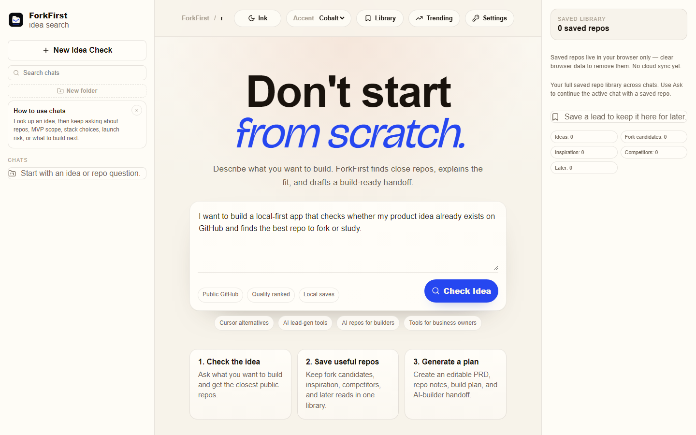
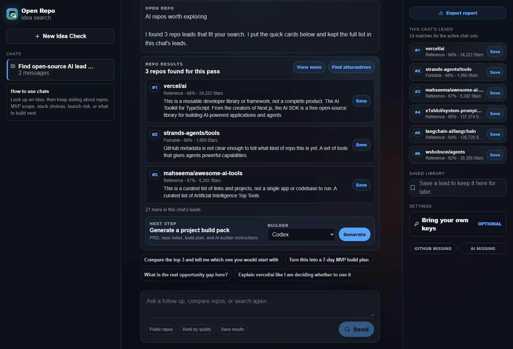
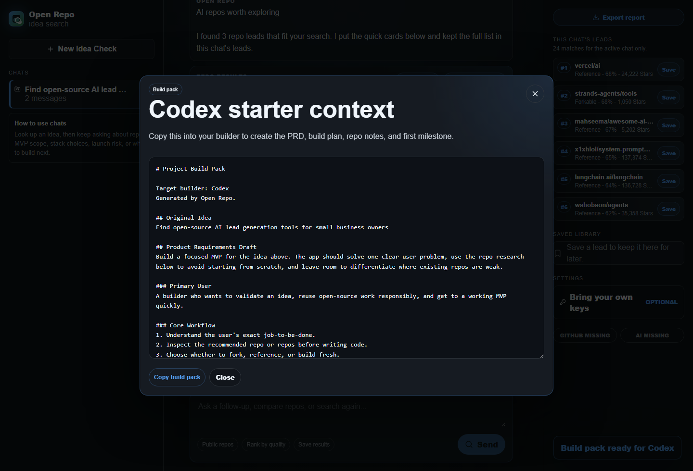

# ForkFirst

[](https://github.com/ZenovaZeni/forkfirst/actions/workflows/ci.yml)
[](https://forkfirst.vercel.app)
[](./LICENSE)
[](https://nextjs.org/)
[](#security-model)

> Do not make your AI builder start from zero.

Talk through your app idea like you would with ChatGPT. ForkFirst finds real GitHub projects that can become your foundation, then creates the repo, prompt, and handoff files your AI builder needs to clone, customize, and build your version faster.

[Try the hosted demo](https://forkfirst.vercel.app) · [Read the security model](./SECURITY.md) · [View sample handoffs](#public-sample-handoffs)

## Why this exists

AI coding tools are powerful, but they waste time and tokens when they invent from a blank page. ForkFirst is the step before Claude Code, Codex, Cursor, Replit, Lovable, v0, Gemini CLI, Antigravity, or any similar AI builder:

1. Your plain-English idea.
2. Real GitHub projects most people would not know to search for.
3. A working foundation, useful reference, or avoid signal.
4. Repo, prompt, and handoff files for the AI builder you already use.

## 60-second flow

1. Chat through the idea like you would with ChatGPT.
2. ForkFirst searches GitHub for real projects that could become your starting point.
3. Pick the working foundation, reference repo, or safer next search.
4. Generate the Builder Handoff.
5. Give the repo, prompt, and files to Claude Code, Codex, Cursor, Replit, Lovable, v0, Gemini CLI, Antigravity, or another AI builder.

## Screenshots

| Start with an idea | Compare working foundations | Export the builder handoff |
|---|---|---|
|  |  |  |

## Public sample handoffs

These are example output packets checked against live GitHub Search API results on 2026-05-17. Re-run your own search before building from any repo.

- [Job application tracker](./public/sample-handoffs/job-application-tracker.md)
- [Local-first journal](./public/sample-handoffs/local-first-journal.md)
- [AI agent dashboard](./public/sample-handoffs/ai-agent-dashboard.md)

## Features

- Chat-first GitHub search and ranking.
- Builder Handoff exports for Claude Code, Codex, Cursor, Replit, Lovable, v0, Gemini CLI, and generic Markdown.
- `STARTER_REPO.md`, `PRD.md`, `BUILD_PLAN.md`, `REPO_STARTER_NOTES.md`, `AGENTS.md`, and `CLAUDE.md` style guidance.
- Optional AI chat and idea refinement.
- Saved repos, boards, editable handoff docs, and shareable handoff URLs.
- Live trending starter feeds from GitHub Search.
- Prompt packs for reusable builder rules.
- PWA install support.
- Demo mode without paid keys.

## AI Builder Handoff Audit

ForkFirst is also the workflow behind a done-for-you Zenova service:

> Send your app idea. We find the best working repo foundation, inspect reuse risks, and deliver a Cursor/Codex/Claude-ready build handoff.

Suggested service tiers:

- **Quick Handoff:** one idea, starter repo recommendation, and first build plan.
- **Deep Repo Audit:** compare several foundations, docs, activity, license signals, and reuse risks.
- **Build Plan + Setup:** handoff plus initial repo setup direction for an AI builder.

## Security model

ForkFirst is BYOK: bring your own GitHub and AI provider keys. Keys are session-only by default. Persistent browser storage is opt-in.

When you run verification, repo research, chat, or live trending with a GitHub token, the browser sends the relevant key to the running Next.js API route. That route forwards the key to GitHub or your selected AI provider for the action you triggered. Keys are not intentionally logged, written to SQLite, or stored server-side.

Hosted use and local use are different:

- Hosted site: the API route runs on the hosted server, so you must trust that deployment while the request is in flight.
- Local clone: the API route runs on your machine, then forwards to GitHub or your chosen provider.

See the in-app `/security` page and [SECURITY.md](./SECURITY.md) for the full model, including custom base URL rules, remaining risks, and reporting instructions.

## Public deployment hardening

For local development, ForkFirst uses in-memory rate limits. For a public hosted deployment, configure durable rate limiting:

```bash
UPSTASH_REDIS_REST_URL=
UPSTASH_REDIS_REST_TOKEN=
```

Without those values, rate limits reset across serverless instances and restarts.

Keep these defaults off for unauthenticated public deployments unless you know exactly why you are changing them:

```bash
FORKFIRST_ALLOW_SERVER_KEYS=false
FORKFIRST_ENABLE_SERVER_DB=false
FORKFIRST_ALLOW_PRIVATE_BASE_URLS=false
```

Server-side fallback keys are dangerous on a public no-login site because visitors could spend your quota. Server-side research persistence needs auth, tenant isolation, deletion/export controls, and a privacy policy.

## Known audit note

`npm audit --audit-level=moderate` currently reports a moderate PostCSS advisory through Next.js's bundled dependency. The forced audit fix suggests downgrading Next to `9.3.3`, which is not acceptable. Track this in [docs/security-advisories.md](./docs/security-advisories.md) and upgrade Next when a stable patched path is available.

## Run locally

Requires Node.js 20 or newer. No keys are required for demo mode.

```bash
git clone https://github.com/ZenovaZeni/forkfirst.git
cd forkfirst
npm install
cp .env.example .env.local   # optional
npm run dev
```

Open `http://localhost:3000`.

Optional key links:

- [GitHub Personal Access Token](https://github.com/settings/personal-access-tokens)
- [OpenAI API key](https://platform.openai.com/api-keys)
- [Groq API key](https://console.groq.com/keys)
- [DeepSeek API key](https://platform.deepseek.com/api_keys)

## Verification

```bash
npm run lint
npm run typecheck
npm test
npm run build
```

## Report a security issue

Do not open public issues with secrets, tokens, or exploit details. Use a private GitHub Security Advisory:

[Report a vulnerability privately](https://github.com/ZenovaZeni/forkfirst/security/advisories/new)

## Docs

- [BYOK guide](./docs/byok.md)
- [Setup and cost notes](./docs/setup-and-cost.md)
- [Demo prompts](./docs/demo-prompts.md)
- [Privacy](./PRIVACY.md)
- [Security](./SECURITY.md)
- [Contributing](./CONTRIBUTING.md)
- [Roadmap](./ROADMAP.md)

## Contributing

PRs welcome. Keep demo mode usable without paid keys, keep BYOK copy accurate, and do not claim license safety for surfaced repos.

## License

MIT.
